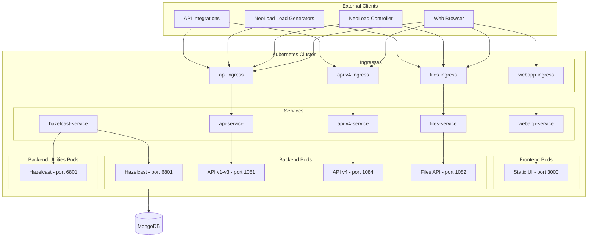

# NeoLoad Web

[NeoLoad Web](https://www.neotys.com/neoload/overview) allows testing teams to view, analyze and monitor tests wherever they're running from and wherever the teams are. Enabling real-time access to this information improves anomaly detection by allowing performance trending and simplifying root cause analysis. 

SaaS version is available [here](https://neoload.saas.neotys.com/) 

**Key features**

- Share a centralized view of the tests from anywhere in the world in real time
- Monitor big trends with graphs
- Get a closer look by diving into the details of a test
- Test data is hosted in the NeoLoad Web Cloud: tests can be accessed even when the NeoLoad Controller which launched them is not available

## Introduction

This chart deploys NeoLoad Web on your Kubernetes cluster.

> [!WARNING]
> **Chart version 3.x** is only compatible with **NeoLoad Web version 2026.1.0 and later**.
>
> For NeoLoad Web versions prior to 2026.1.0, please use the Helm chart from the [`v2.x` branch](https://github.com/Neotys-Labs/helm-neoload-web/tree/v2.x).

## License

NeoLoad is licensed under the following [License Agreement](https://www.neotys.com/documents/legal/eula/neoload/eula_en.html). You must agree to this license agreement to download and use the image.

> [!NOTE]
> This license does not permit further distribution.

## Targeted audience

This chart is meant for experienced Kubernetes/Helm users as a successful installation and running of the application is very environment dependant.

> [!IMPORTANT]
> NeoLoad Web instances deployed with this Helm Chart will only be supported if overseen by NeoLoad services. Please speak to your NeoLoad Account Manager.

## Prerequisites

### Hardware

NeoLoad Web will require your cluster to run a minimum of 3 pods, hosting the frontend, backend, and backend-utilities separately.
Here is a table to help you estimate the resource requirements of your nodes based on the default `resources.*` values.

Deployment | Content | Requirements
----- | ----------- | -----
Minimal | 1 Frontend Pod, 1 Backend Pod, 1 Backend-Utilities Pod | **1.55 CPU, 5.1Gi RAM**
Recommended | 2 Frontend Pods, 2 Backend Pods, 1 Backend-Utilities Pod | **2.6 CPU, 8.2Gi RAM**

For custom deployments, multiply each pod count by its default resource requirements and sum the totals [(see Advanced Configuration)](#advanced-configuration):
- **Frontend**: 50m CPU, 0.1Gi RAM
- **Backend**: 1 CPU, 3Gi RAM
- **Backend-Utilities**: 0.5 CPU, 2Gi RAM

> [!NOTE]
> If you modify the default resource values via `resources.frontend.*`, `resources.backend.*`, or `resources.backendUtilities.*`, you must recompute the total resources required accordingly.

### Software

- [kubectl](https://kubernetes.io/docs/tasks/tools/install-kubectl/) CLI
- [Helm](https://helm.sh/docs/intro/install/) CLI  (^3.0.0)
- A running [Kubernetes](https://kubernetes.io/) cluster (1.18+)
  - Actively supported versions are those that are currently maintained by Kubernetes ([see supported versions](https://kubernetes.io/releases/patch-releases/#detailed-release-history-for-active-branches))
  - The cluster [PodPidsLimit](https://kubernetes.io/docs/concepts/policy/pid-limiting/#pod-pid-limits) must be at least 2048
- A running [mongodb](https://www.mongodb.com/) accessible from the Kubernetes cluster ([see supported versions](/doc/mongo-prerequisites.md))
- A running ingress controller deployed on the Kubernetes cluster

#### Ingress controller

You can use your favorite [ingress controller](https://kubernetes.io/docs/concepts/services-networking/ingress-controllers/) for enabling your ingresses to route external traffic to NeoLoad Web.

This chart is tested, maintained and shipped with default values for the nginx ingress controller.
Supported ingress controllers are: nginx, OpenShift.

You can find documentation for nginx ingress controller [here](https://kubernetes.github.io/ingress-nginx/).
You can find documentation for OpenShift ingress controller [here](https://docs.openshift.com/container-platform/4.7/networking/ingress-operator.html).

Basic configuration options are detailled [here](https://kubernetes.github.io/ingress-nginx/deploy/) and you can find advanced configuration options [here](https://kubernetes.github.io/ingress-nginx/user-guide/nginx-configuration/).

> [!CAUTION]
> Using another ingress controller may require additional chart tuning from your part.

#### MongoDB Prerequisites

You can find your external MongoDB prerequisites [here](/doc/mongo-prerequisites.md).

> [!CAUTION]
> You _CANNOT_ connect multiple NeoLoad Web instances (whether they are in the same namespace or not) to the same MongoDB instance.

#### OpenShift

You have a specific values-custom to ease the deployment of NeoLoad Web on OpenShift: values-custom-openshift.yaml.

In this file you will have to modify the security context parameters to match your cluster rights.
You can find documentation on security context [here](https://kubernetes.io/docs/tasks/configure-pod-container/security-context/).

To enable TLS on your routes you should:
- Have a valid certificate.
- Fill your certificate in the values-custom-openshift.yaml file.
- Or reference the name of the secret that holds that certificat.

## Installation

1. Add the Neotys chart repository or update it if you already had it registered

```bash		
helm repo add neotys https://helm.prod.neotys.com/stable/
```

```bash		
helm repo update
```

2. Download and set up your **[values-custom.yaml](/values-custom.yaml)** file

```bash
wget https://raw.githubusercontent.com/Neotys-Labs/helm-neoload-web/master/values-custom.yaml
```
>You can refer to the ['Getting started'](#getting-started) section for basic configuration options.

3. Create a dedicated namespace

```bash		
kubectl create namespace my-namespace
```

4. Install with the following command

```bash		
helm install my-release neotys/nlweb -n my-namespace -f ./values-custom.yaml
```

> Since Helm 3.2+ you can skip step 3, and add the --create-namespace option to this command

## Uninstall

To uninstall the `my-release` deployment:

```bash
$ helm uninstall my-release -n my-namespace
```

## Upgrade

> [!WARNING]
> **This documentation is for Chart v3.** Migrating from Chart v2 to v3 includes breaking changes. Please review the [2025.2.x to 2026.1.x Upgrade Guide](./doc/upgrade-2025.2.x-to-2026.1.x.md) before upgrading.

You can use the `helm upgrade` command when you want to :
1. Upgrade your NeoLoad Web installation.
2. Benefit from a newer chart version.
3. Change some values/environment variables in your deployment.

> [!WARNING]
> In that last case, keep in mind that when updating your repositories, you may fetch a new chart/application version that could change your whole deployment. To avoid that, you can add the `--version=x.x.x` to the `helm upgrade` command and force your chart version to remain the same as the one deployed.

```bash		
helm repo update
```

```bash		
helm upgrade my-release neotys/nlweb -n my-namespace -f ./values-custom.yaml
```

### Upgrade guides

The following docs can help you when migrating chart version with breaking changes.

| Targeted versions | Link |
| -------- | ---- | 
| 1.x.x to 2.x.x | [Upgrade Guide](/doc/upgrade-1.x.x-to-2.x.x.md) |
| 2.x.x to 2.3.x | [Upgrade Guide](/doc/upgrade-2.x.x-to-2.3.x.md) |
| 2.3.x to 2.4.x | [Upgrade Guide](/doc/upgrade-2.3.x-to-2.4.x.md) |
| 4.2.x to 2023.1.x | [Upgrade Guide](/doc/upgrade-4.2.x-to-2023.1.x.md) |
| 2025.2.x to 2026.1.x | [Upgrade Guide](/doc/upgrade-2025.2.x-to-2026.1.x.md) |

### Version compatibility

Due to Helm Charts nature, there are two distinct version numbers to keep track of :
- NeoLoad Web version
- The Chart version

You should always upgrade ([see the upgrade section](#upgrade)) with the new chart version, as we release a new one for every NeoLoad Web release we make. But you also have the possibility to manage independantly NeoLoad Web version by changing the images tags ([see `image.backend.repository` and `image.frontend.repository`](#advanced-configuration) ).

However you should be aware of the following compatibility table to understand which combinations are supported.

_ | NeoLoad Web Version < 2.9.X | NeoLoad Web Version >= 2.9.X and < 2026.1.0 | NeoLoad Web Version >= 2026.1.0
--|-----------------|-----------------|------------------
Chart Version < 2.0.0 | OK | OK | **KO**
Chart Version >= 2.0.0 and < 3.0.0 | **KO** | OK | **KO**
Chart Version >= 3.0.0 | **KO** | **KO** | OK

## Architecture

This schema describes:
* Components created inside the kubernetes cluster by this chart
* How they interact between them
* How they interact with components outside the cluster:
  * NeoLoad Web UI through a web browser
  * NeoLoad Controller
  * NeoLoad Load Generator
  * Any integration based on NeoLoad Web API
  * MongoDB server



### Backend-Utilities Component

The **backend-utilities** component handles resource-intensive tasks such as PDF report generation. It uses a separate technical stack optimized for these workloads, isolating them from the main backend to avoid impacting API performance.

List of features requiring backend-utilities to be deployed:
- Dashboard PDF export

By default, only a single replica of this Pod is deployed to reduce resource consumption.
You can increase this by changing the value of `replicaCount.backendUtilities` to a higher number.
You can also disable it by setting `replicaCount.backendUtilities: 0` if you don't plan to use these features and prefer to save resources.

This component may be extended to support additional features in future releases.

> [!NOTE]
> Deploying backend-utilities is optional. Setting `replicaCount.backendUtilities: 0` disables the component, but PDF generation will not be available.

## High Availability

NeoLoad Web supports **High Availability**, allowing you to scale your frontend and backend pods for improved resilience and failure tolerance.

> Use `replicaCount.frontend`, `replicaCount.backend`, and `replicaCount.backendUtilities` values to arrange your deployment the way you see fit. By default, 2 frontend instances, 2 backend instances, and 1 backend-utilities instance are deployed for a resilient NeoLoad Web application out of the box.

Your cluster must be able to deploy at least 5 pods by default (2 frontend, 2 backend, and 1 backend-utilities). For a minimal deployment, you can run with 2 pods (1 frontend and 1 backend), accepting the lack of features related to backend-utilities (see [Backend-Utilities Component](#backend-utilities-component)). Some nodes may restrict the number of simultaneous pods, so ensure this is allowed.

### Discovery Modes

High Availability relies on pod discovery to form a cluster. The discovery mechanism is configured via `neoload.configuration.ha.mode`.

#### API Mode (default)

API mode uses the Kubernetes API for pod discovery. This requires a ClusterRole and ClusterRoleBinding to be deployed, granting the service account permission to query pods and endpoints. These resources are created automatically by the chart.

See [cluster-role.yaml](/templates/cluster-role.yaml) for details on the required permissions.

> [!NOTE]
> If you prefer to manage ClusterRole and ClusterRoleBinding resources externally (e.g., through your own infrastructure tooling), you can disable their automatic creation by setting `clusterRbac.enabled: false`.

#### DNS Mode

DNS mode uses DNS-based discovery and does not require a ClusterRole. This makes it suitable for restricted environments where granting Kubernetes API access to pods is not allowed.

To enable DNS mode, add the following to your values file:

```yaml
neoload:
  configuration:
    ha:
      mode: "DNS"
```

## Configuration

### Getting started

Here is a guide for a quick setup of your `values-custom.yaml` file.

> [!NOTE]
> We suggest you maintain your own *values-custom.yaml* and update it with your relevant parameters, > but you can also specify each parameter using the `--set key=value[,key=value]` argument to `helm install`. For example,
> 
> ```bash
> $ helm install my-release \
>     --set ingress.tls=[] \
>     neotys/nlweb
> ```


#### MongoDB configuration

##### Host and port

The preferred way to configure MongoDB connection information is to replace `YOUR_MONGODB_HOST_URL` by the
full connection string URI. See [MongoDB official documentation](https://www.mongodb.com/docs/v4.4/reference/connection-string/). <br/>
You must also set `port` to `0`. <br/>
Username and/or password can be provided in the URI, special characters must be URL-encoded. By doing this, you must set `usePassword` to `false` in the below section "Authentication".

```yaml
neoload:
  configuration:
    backend:
      mongo:
        host: YOUR_MONGODB_HOST_URL
        port: 0

```

> [!TIP]
> For MongoDB requiring SSL connection, the `host` value must look like: `mongodb://mongo.mycompany.com:27017/admin?ssl=true`

> [!TIP]
> For MongoDB as a cluster of machines (replica set), the `host` value must look like: `mongodb://rs1.mongo.mycompany.com:27017,rs2.mongo.mycompany.com:27017,rs3.mongo.mycompany.com:27017/admin`

> [!TIP]
> For MongoDB connection with DNS Seedlist Connection Format, the `host` value must look like: `mongodb+srv://rs1.mongo.mycompany.com:27017,rs2.mongo.mycompany.com:27017,rs3.mongo.mycompany.com:27017/admin`

> [!NOTE]
> The compatibility with older configurations is kept. The `host` and `port` values can be set to your MongoDB server hostname and port according to your setup.

> [!NOTE]
> Other custom connection options are supported, see MongoDB connection string options official documentation [here](https://www.mongodb.com/docs/v4.4/reference/connection-string/).

##### Authentication

Depending on your mongoDB setup you must specify if an authentication is required or not. There are three options:

- Set user info directly in the URI (see above section "Host and port")
- Set `mongodb.usePassword` to `true` and replace the `YOUR_MONGODB_USER` and `YOUR_MONGODB_PASSWORD` placeholders accordingly in below example.

```yaml
### MongoDB user configuration
mongodb:
  usePassword: true
  mongodbUsername: YOUR_MONGODB_USER
  mongodbPassword: YOUR_MONGODB_PASSWORD
```

- Use an existing Secret by specifying its name in `mongodb.existingSecret`. The existing secret must have the keys `username` and `password`. This takes precedence over the two previous options.


#### NeoLoad Web secret key

The NeoLoad Web secret key is used to encrypt and decrypt the passwords that are stored by NeoLoad Web.
It must be 8 characters minimum.
If not set, NeoLoad Web will not start.

The secret key can be specified in two ways:

- Set the key in `neoload.configuration.secretKey`

```yaml
neoload:
  configuration:
    # The secret key must be at least 8 characters long
    secretKey: MySecretKeyForNeoLoadWeb
```

- Use an existing secret specifying its name in `neoload.configuration.secretKeyExistingSecret`. The existing Secret must contain the keys `nlwSecretKey` and `internalTokenSecret`. This takes precedence over `secretKey`.

> [!WARNING]
> Do not modify this key from one deployment to another, otherwise NeoLoad Web will not be able to read previously stored secrets from your database.

#### NeoLoad Web URLs and Domain

NeoLoad Web needs to know the set of hostnames it will be available under, as well as the domain for cookie management. You need to carefully configure them.

##### Domain

The `domain` parameter is **required**. It configures the cookie domain, allowing authentication cookies to work across all NeoLoad Web subdomains (webapp, api, files). It is also used to compute the base CORS allowed origin pattern.

If your frontend and API URLs are `neoload-web.mycompany.com` and `neoload-web-api.mycompany.com`, then the domain must be `.mycompany.com` (note the leading dot).

```yaml
domain: .mycompany.com
```

##### Service Hostnames

```yaml
services:
  webapp:
    host: neoload-web.mycompany.com
  api:
    host: neoload-web-api.mycompany.com
  files:
    host: neoload-web-files.mycompany.com
  # Optional: separate hostname for API v4 (defaults to api host if not set)
  # api-v4:
  #   host: neoload-web-api-v4.mycompany.com
```

> [!NOTE]
> You must configure your DNS records. These 3 hostnames (plus `api-v4` if configured separately) must point to the Ingress controller endpoint.

> [!TIP]
> If the ingress controller is bound to the IP 10.0.0.0, your must define the following DNS records:
>```
>neoload-web.mycompany.com.        60 IN A	10.0.0.0
>neoload-web-api.mycompany.com.    60 IN A	10.0.0.0
>neoload-web-files.mycompany.com.  60 IN A	10.0.0.0
>```
>


### Advanced configuration

For more advanced configuration options you can refer to the [Advanced configuration page](/doc/advanced-configuration.md)

Here are some of the addressed subjects:

- [Values references](/doc/advanced-configuration.md#values-reference)
- [CORS allowed origins](/doc/advanced-configuration.md#cors-allowed-origins)
- [Side-car containers](/doc/advanced-configuration.md#side-car-containers
)
- [Custom environment variables](/doc/advanced-configuration.md#custom-environment-variables)
- [Logger configuration](/doc/advanced-configuration.md#logger-configuration)


## TLS

If you want to secure NeoLoad Web through TLS, you should either:
 - configure [TLS at ingress level](#ingress-tls-termination)
 - handle [TLS termination on front of the Ingress controller](#external-tls-termination)

### Ingress TLS termination

To enable TLS and access NeoLoad Web via https, the parameters :

- `ingress.enabled` must be true
- `ingress.tls` must contain at least one item with the tls secret data

> [!CAUTION]
> Ingresses support multiple TLS mapped to respective hosts and paths. This feature is not supported for NeoLoad Web, i.e. exactly zero or one TLS configuration is expected.

#### Using an existing TLS secret

Simply refer to your secret in the `ingress.tls[0].secretName` parameter, and leave both `ingress.tls[0].secretCertificate` and `ingress.tls[0].secretKey` empty.

#### Creating a new TLS secret

##### Provide a certificate and a private key

Use the following documentation or use your own means to provide both a certificate and a private key.

- [Kubernetes TLS Secret generation documentation](https://kubernetes.github.io/ingress-nginx/user-guide/tls/)

##### Add these to your custom values file

Copy the content of the files into the `ingress.tls[0].secretCertificate` and `ingress.tls[0].secretKey` parameters.

##### Specify your new TLS secret name

Set a name for your new TLS secret name into the `ingress.tls[0].secretName` parameter.

### External TLS termination

> [!CAUTION]
> If you choose to handle TLS on front of the Ingress controller, we recommend, for security reason, to set the 
> value of the property `neoload.configuration.externalTlsTermination` to `true`.
>
> It will enable the 'https://' protocol in NeoLoad Web URLs and configuration. 

## Usage data

NeoLoad Web collects and sends anonymized usage and navigation data to our servers in order to continuously improve our products.

You can disable this option by setting the `neoload.configuration.sendUsageStatistics` key to `false`.

NeoLoad Web gathers and sends data related to the usage of specific features and services.


## Troubleshooting

### SSO error: "Size exceed allowed maximum capacity"

If, during SSO authentication, the browser shows the error "Size exceed allowed maximum capacity", it likely means the default maximum size for HTTP form attributes (32768 bytes) is too low for your IdP's payload.

Increase the value using `neoload.configuration.backend.misc.maxFormAttributeSize` in your values file. For example:

```yaml
neoload:
  configuration:
    backend:
      misc:
        maxFormAttributeSize: 65536
```

Note: Set the value according to your IdP needs; larger SSO payloads may require higher limits.
